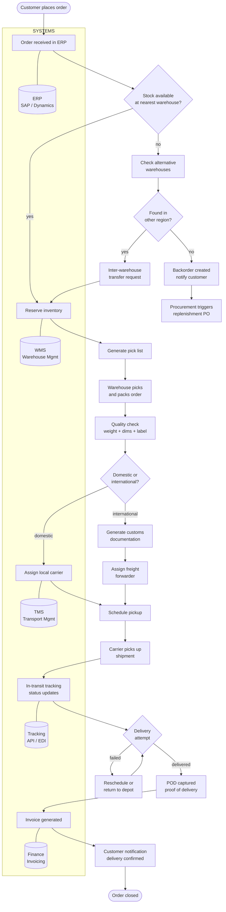
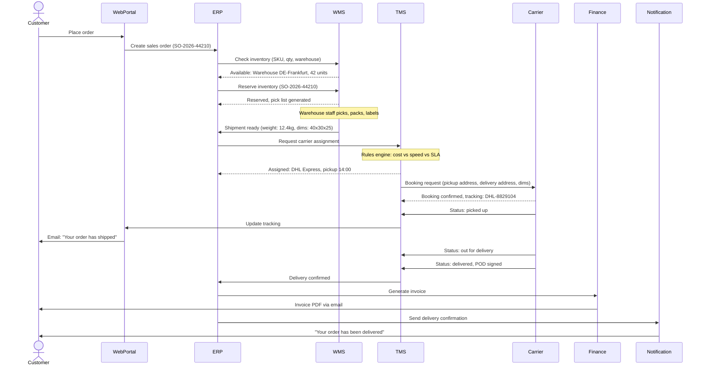
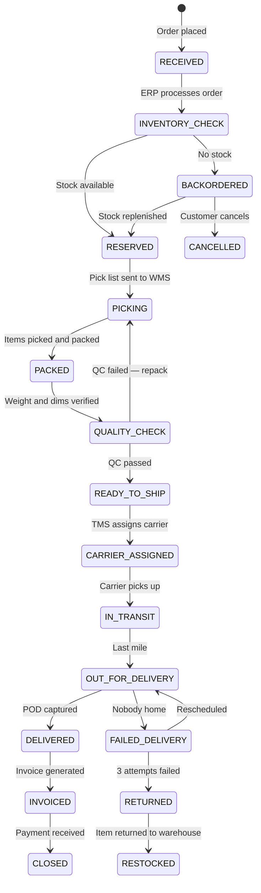

# Global Order-to-Delivery — Process Analysis & AI Opportunity Assessment

> Maps the end-to-end order fulfilment process for a multinational logistics company operating across EU, US, and APAC.
> Identifies operational bottlenecks and evaluates where AI/LLM tools can reduce manual work and improve throughput.

---

## 1. Process Flow — Order to Delivery



---

## 2. Sequence Diagram — System Communication



---

## 3. State Diagram — Order Lifecycle



---

## 4. Bottleneck Analysis

Identified through process walk-throughs with warehouse managers and ops leads across 3 regions.

| #   | Bottleneck                         | Where                | Impact                                                        | Root Cause                                                                |
| --- | ---------------------------------- | -------------------- | ------------------------------------------------------------- | ------------------------------------------------------------------------- |
| 1   | Manual carrier selection           | TMS / Ops team       | 15-20 min per shipment, inconsistent cost decisions           | No automated rules engine — dispatcher picks carrier from habit, not data |
| 2   | Customs documentation              | International orders | 30-45 min per shipment, frequent errors causing border delays | Manual form filling from order data, copy-paste between systems           |
| 3   | Email-based status inquiries       | Customer service     | ~800 emails/week asking "where is my order?"                  | Tracking page exists but customers don't find it, no proactive updates    |
| 4   | Stock visibility across warehouses | Inventory team       | Over-ordering in some regions, stockouts in others            | Each warehouse runs own WMS instance, no real-time consolidated view      |
| 5   | Invoice discrepancies              | Finance              | 12% of invoices need manual correction                        | Weight/dims captured manually at packing, transcription errors            |

---

## 5. AI Opportunity Assessment

For each bottleneck, assessed whether AI is the right solution or whether a simpler fix exists. Not everything needs AI — sometimes a process fix or a basic automation is enough.

### Bottleneck 1: Carrier Selection → AI-ASSISTED DECISION

**Current:** Dispatcher manually picks carrier based on experience.
**Proposed:** ML model trained on historical shipment data recommends optimal carrier per shipment based on destination, weight, SLA, cost, and carrier performance history.
**Why AI and not rules:** Rules work for simple cases (domestic = local carrier). But for international with 15+ carriers, varying performance by route, and fluctuating costs — a model that learns from outcomes outperforms static rules.
**Human-in-the-loop:** Model recommends top 3 carriers with rationale. Dispatcher approves or overrides. No blind automation.
**Expected impact:** 10-15% reduction in shipping cost, 90% faster assignment (seconds vs 15 min).

### Bottleneck 2: Customs Documentation → LLM DOCUMENT GENERATION

**Current:** Staff manually fills customs forms by copying data from the order.
**Proposed:** LLM extracts order data from ERP and auto-generates customs documentation (commercial invoice, packing list, HS codes).
**Why LLM:** Customs forms are semi-structured documents with variable fields per destination country. An LLM handles the variability better than rigid templates — it can adapt to different country requirements without code changes.
**Validation:** Generated documents go through automated field validation (are all required fields filled? do HS codes match product category?) before human sign-off.
**Expected impact:** 80% reduction in preparation time (from 35 min to 7 min per shipment), significant reduction in border rejections due to documentation errors.

### Bottleneck 3: Customer Inquiries → AI CHATBOT + PROACTIVE UPDATES

**Current:** Customer service answers ~800 emails/week manually about delivery status.
**Proposed:** Two-part solution. First, proactive status notifications at each stage (picked up, in transit, out for delivery) via email and SMS — eliminates most inquiries before they happen. Second, an AI chatbot for remaining questions that pulls real-time tracking data and answers in natural language.
**Why AI chatbot and not FAQ page:** Customers ask in their own language about their specific order ("where is order 44210?"). A chatbot connected to the TMS API can give personalised, real-time answers. A static FAQ cannot.
**Expected impact:** 60-70% reduction in status inquiry emails. Customer service team freed to handle complex issues (damaged goods, returns, complaints).

### Bottleneck 4: Stock Visibility → NOT AI — INTEGRATION PROJECT

**Current:** Each warehouse has its own WMS. No consolidated real-time view.
**Proposed:** Data integration layer that aggregates inventory from all WMS instances into a single dashboard. This is an ETL/integration project, not an AI project.
**Why not AI:** The problem is missing data, not complex data. Once you have consolidated stock data, simple threshold alerts ("Frankfurt stock below reorder point") are sufficient. AI would be over-engineering.
**Honest assessment:** If someone proposes "AI-powered inventory optimization" for this, they're selling. Fix the data first. Maybe add demand forecasting later once the data foundation exists.

### Bottleneck 5: Invoice Discrepancies → COMPUTER VISION + VALIDATION

**Current:** Weight and dimensions captured manually on paper at packing station, then entered into ERP.
**Proposed:** Automated dimensioning system at packing station (camera + scale) feeds data directly into WMS. No manual entry, no transcription errors.
**Why not LLM:** This is a measurement problem, not a language problem. A camera and scale solve it better than any language model. The AI component is computer vision for reading package labels and matching them to the correct order — preventing the wrong label on the wrong box.
**Expected impact:** Invoice correction rate drops from 12% to under 2%.

### Prioritisation Matrix

```
                    HIGH IMPACT
                        |
  Customs docs (2)      |    Carrier selection (1)
  Quick Win — LLM       |    Strategic — ML model
  (low effort, high $)  |    (medium effort, high $)
                        |
  ──────────────────────┼──────────────────
                        |
  Chatbot (3)           |    Stock visibility (4)
  Fill-in — good but    |    Foundation — do this
  not urgent            |    but it's not AI
                        |
                    LOW IMPACT

            LOW EFFORT ──────── HIGH EFFORT
```

Invoice fix (5) sits outside the matrix — it's a hardware solution (camera + scale), not a software decision.

**Recommended order:**

1. Customs documentation (LLM) — highest ROI, fastest to deploy, proves AI value
2. Carrier selection (ML) — requires training data, build in parallel
3. Proactive notifications — simple integration, no AI needed, big impact
4. Chatbot — deploy after proactive updates reduce volume
5. Stock visibility — infrastructure project, enable future AI

---

## 6. AS-IS vs TO-BE

| Step                           | AS-IS                                          | TO-BE                                          | Change Type              |
| ------------------------------ | ---------------------------------------------- | ---------------------------------------------- | ------------------------ |
| Carrier selection              | Manual, 15-20 min, based on habit              | AI-recommended, dispatcher approves in 30 sec  | AI-assisted decision     |
| Customs documentation          | Manual copy-paste, 30-45 min, frequent errors  | LLM auto-generated, human validation, 7 min    | LLM automation           |
| Status inquiries               | 800 emails/week, manual response               | Proactive notifications + AI chatbot           | Process fix + AI         |
| Stock visibility               | Per-warehouse, no consolidated view            | Integrated dashboard, real-time                | Data integration (no AI) |
| Weight/dims capture            | Paper-based, manual entry, 12% error rate      | Automated camera + scale, direct to WMS        | Hardware automation      |
| Overall order-to-delivery time | 3-5 days (domestic), 7-14 days (international) | 2-3 days (domestic), 5-10 days (international) | Combined effect          |

---

## 7. Change Management Considerations

AI tools are worthless if people don't use them. Each bottleneck fix requires a different adoption approach because different teams are affected.

**Dispatchers (carrier selection AI):**
Highest risk of resistance. They've been doing this for years and their expertise IS the carrier selection. The model must be positioned as "your assistant that handles the boring shipments so you can focus on the complex ones" — not as a replacement. Start with it as recommendation-only. Let dispatchers see it's right 90% of the time. They'll start trusting it naturally.

**Customs documentation team:**
Most likely to welcome AI. They hate the copy-paste work. Frame it as "we're removing the drudgery." Let them validate outputs — this keeps them relevant while the boring part disappears. They become quality reviewers instead of data entry clerks.

**Customer service:**
Chatbot rollout needs care. Agents may fear replacement. Position it as "the chatbot handles the 800 'where is my order' emails so you can focus on the cases that actually need a human — damaged goods, billing issues, complex complaints." Track both channels — if customers start complaining about the chatbot, scale back immediately.

**Warehouse staff (dimensioning system):**
Easiest adoption — the new system removes a step they didn't enjoy. No change management needed beyond training on the new hardware.

**Metrics to track across all changes:**

- Tool adoption rate per week (are people using it?)
- Override rate (how often do dispatchers reject AI recommendation?)
- Error rate before vs after
- Time per task before vs after
- User satisfaction survey at 30 and 90 days
