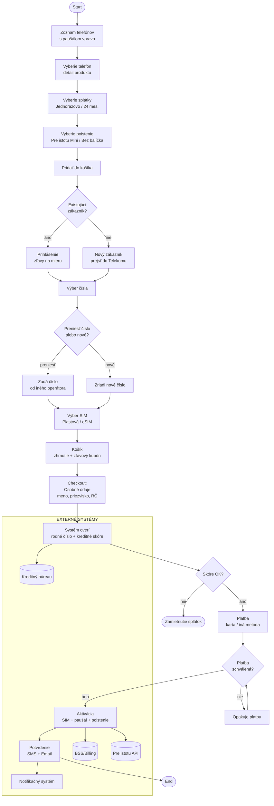
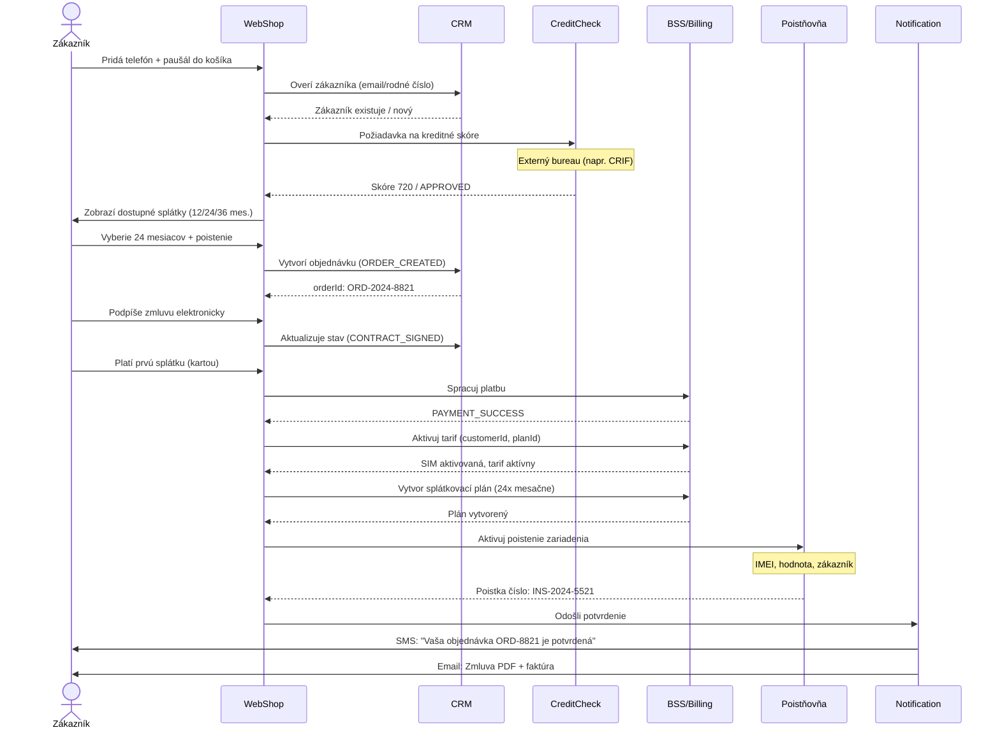
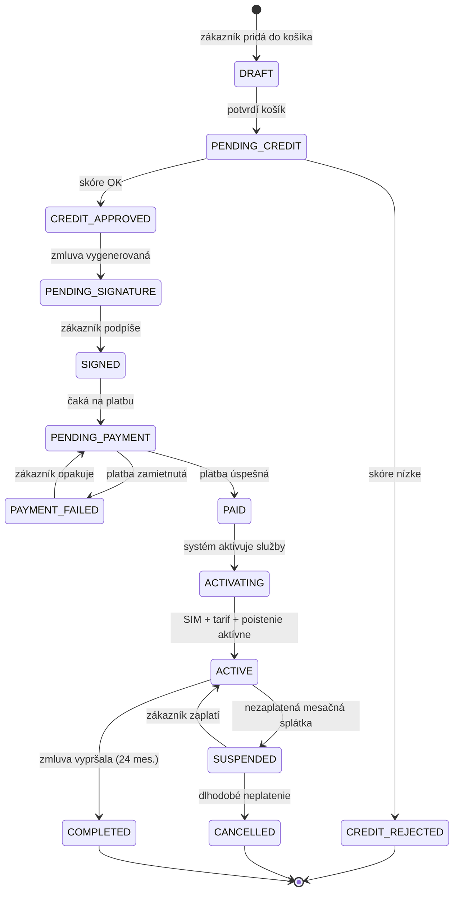
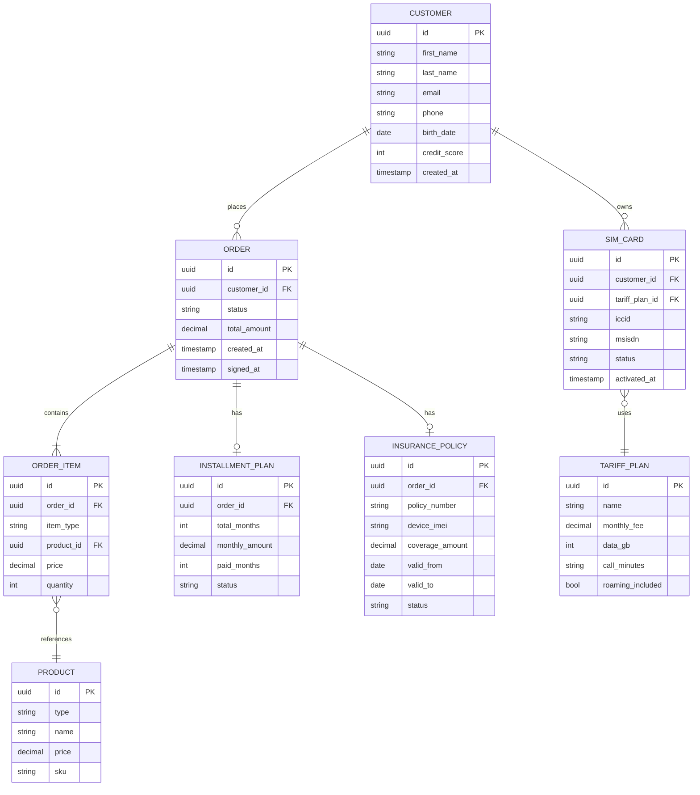

# Nákupný scenár — Telefón + Paušál + Poistenie

> Modeluje kompletný nákupný tok zákazníka v telekomunikačnej spoločnosti.
> Scenár: zákazník si kúpi smartphone na splátky s paušálnym tarifom a poistením zariadenia.

---

## 1. Purchase Flow — Nákupný proces (telekom.sk)



---

## 2. Sekvenčný diagram — Systémová komunikácia



---

## 3. Stavový diagram — Stavy objednávky



---

## 4. ERD — Dátový model



---

## 5. Popis skrátenia nákupného scenára

### AS-IS (pôvodný proces — pred optimalizáciou)

```
Krok 1: Výber telefónu          (1 stránka)
Krok 2: Výber paušálu           (1 stránka)
Krok 3: Výber poistenia         (1 stránka)
Krok 4: Registrácia / Login     (1 stránka)
Krok 5: Kreditná verifikácia    (manuálne, 1-2 dni)
Krok 6: Zmluva — tlač, podpis   (pobočka alebo pošta)
Krok 7: Aktivácia               (manuálne, 24-48 hodín)
Krok 8: Potvrdenie              (email)

Celkový čas: 2-5 dní
Kroky: 8
```

### TO-BE (optimalizovaný proces)

```
Krok 1: Výber telefónu + paušálu + poistenia  (1 stránka, bundle)
Krok 2: Identifikácia (eID alebo existujúci účet)
Krok 3: Automatická kreditná verifikácia      (real-time, API)
Krok 4: Elektronický podpis                  (OTP cez SMS)
Krok 5: Platba                               (karta / Apple Pay)
→ Automatická aktivácia SIM + tarif + poistenie

Celkový čas: 15 minút
Kroky: 5 (z 8 na 5)
```

### Kde boli odstránené kroky

| Odstránený krok                      | Ako                            | Prínos                  |
| ------------------------------------ | ------------------------------ | ----------------------- |
| Samostatné stránky pre každý produkt | Bundle výber na 1 stránke      | -3 kroky, -30% drop-off |
| Manuálna kreditná verifikácia        | Real-time API do Credit Bureau | 2 dni → 3 sekundy       |
| Papierová zmluva                     | Elektronický podpis cez OTP    | Pobočka nie je potrebná |
| Manuálna aktivácia                   | API volanie do BSS pri platbe  | 48 hodín → okamžite     |
