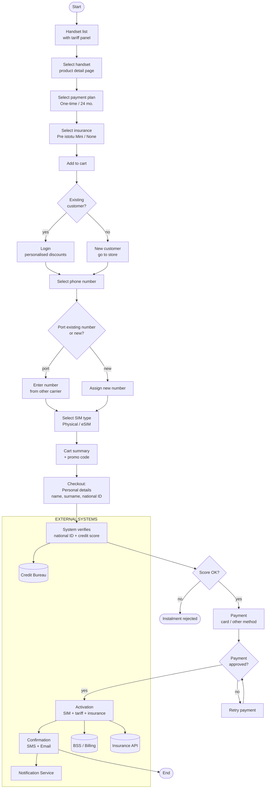
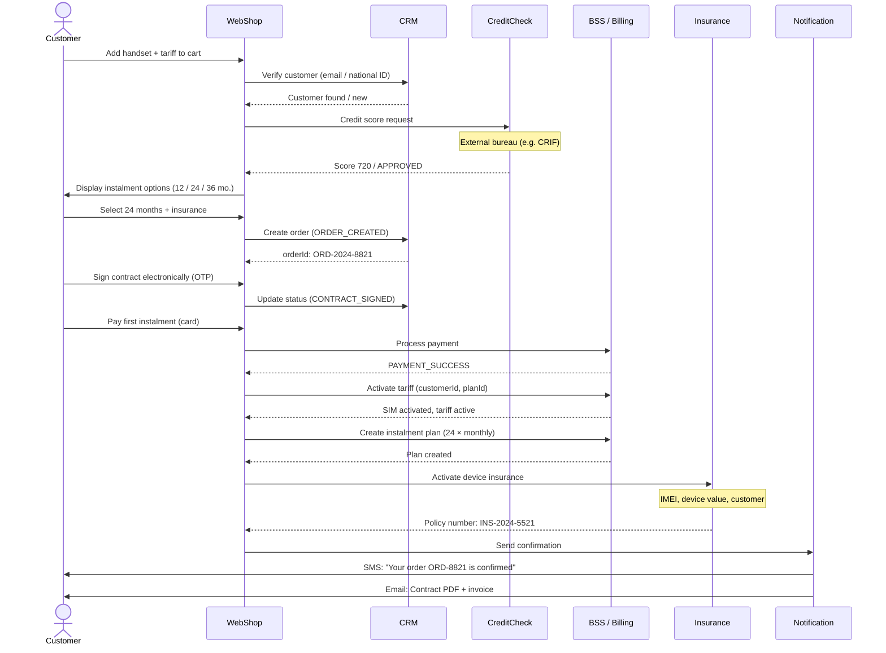
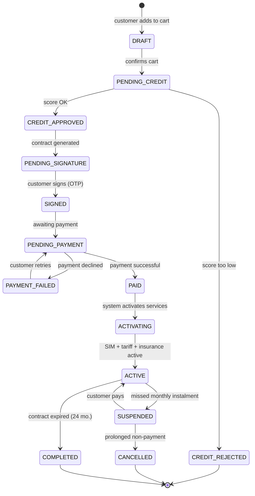
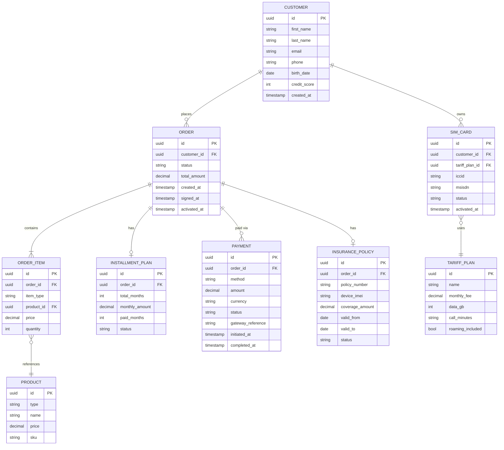

# Purchase Scenario — Handset + Tariff + Insurance

> Models the full online purchase journey at a telecommunications company.
> Scenario: customer buys a smartphone on instalment with a monthly tariff plan and device insurance.

---

## 1. Purchase Flow



---

## 2. Sequence Diagram — System Communication



---

## 3. State Diagram — Order Lifecycle



---

## 4. ERD — Data Model



---

## 5. AS-IS vs TO-BE

### AS-IS — before optimisation

```
Step 1: Select handset            (1 page)
Step 2: Select tariff plan        (1 page)
Step 3: Select insurance          (1 page)
Step 4: Registration / Login      (1 page)
Step 5: Credit verification       (manual, 1–2 days)
Step 6: Contract — print, sign    (branch visit or post)
Step 7: Activation                (manual, 24–48 hours)
Step 8: Confirmation              (email)

Total time: 2–5 days
Steps: 8
```

### TO-BE — optimised flow

```
Step 1: Select handset + tariff + insurance  (1 page, bundle)
Step 2: Identify customer (eID or existing account)
Step 3: Automated credit check               (real-time API, ~3 sec)
Step 4: Electronic signature                 (OTP via SMS)
Step 5: Payment                              (card / Apple Pay)
→ Automatic activation: SIM + tariff + insurance

Total time: ~15 minutes
Steps: 5 (reduced from 8)
```

### Where steps were removed

| Removed step                  | How                              | Impact                  |
| ----------------------------- | -------------------------------- | ----------------------- |
| Separate page per product     | Bundle selection on 1 page       | −3 steps, −30% drop-off |
| Manual credit verification    | Real-time API to Credit Bureau   | 2 days → 3 seconds      |
| Paper contract + branch visit | Electronic signature via OTP     | No branch visit needed  |
| Manual SIM activation         | API call to BSS on payment event | 48 hours → instant      |
